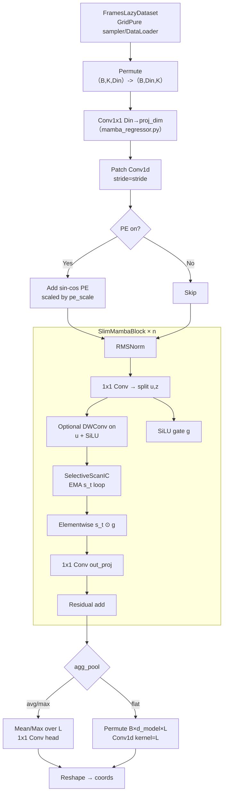
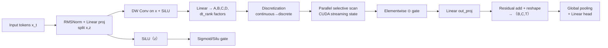
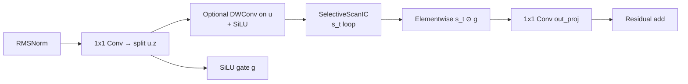

# Ablation Architectures Overview

This note summarizes the three backbones that will be compared in the ablation: the refactored regression stack we currently ship, the original Channel Mamba （C-Mamba） design, and the original Mamba block. All derivations below assume the pure floating-point （non-quantized） implementation so we can focus on architectural effects. For each one the main dataflow and the key equations are listed so they can be referenced when configuring experiments.

## 1. Current Refactored CMamba Regressor



**Equations（aligned with the flowchart）**

1. **Channel projection**  
   `x_perm = permute(x, (0,2,1))`  
   `h0 = Conv1x1_proj(x_perm)` where `Conv1x1_proj: R^{Din} -> R^{proj_dim}`.
2. **Patch embedding and permutation**  
   `x_patch = Conv_patch(h0)` with `W_patch ∈ R^{d_model × proj_dim × patch_len}` and stride `stride`.  
   `L = (K - patch_len) // stride + 1`.  
   `z = permute(x_patch, (0,2,1)) ∈ R^{B × L × d_model}`.
3. **Positional encoding（optional）**  
   `PE[i, 2j] = sin(i / 10000^{2j/d_model})`, `PE[i, 2j+1] = cos(i / 10000^{2j/d_model})`.  
   `z = z + pe_scale * PE` if `pe_on`, with `PE ∈ R^{L × d_model}` cached as `pe_buf`.
4. **SlimMambaBlock（per layer ℓ and token t）**

```matlab
   h_t = RMSNorm(x_t)
   [u_t, z_t] = W_in h_t          # 1x1 Conv yields 2*d_inner channels
   if use_dwconv: u_t = DWConv(u_t)
   u_t = SiLU(u_t)
   λ_t = sigmoid(W_dt * u_t)      # W_dt: 1x1 Conv inside SelectiveScanIC
   s_t = λ_t ⊙ s_{t-1} + (1 - λ_t) ⊙ u_t
   g_t = 1                        # when gate_off
   g_t = SiLU(z_t)                # otherwise
   y_t = W_out(s_t ⊙ g_t)
   x_{t+1} = x_t + y_t
   ```

   `SelectiveScanIC` precomputes all `λ_t` values via a Conv1d on the channel dimension so every token shares the same update coefficients.
1. **Aggregation head inside `CMambaSlim`**  
   - `avg`: `y = Conv_pool(mean(x_last, dim=1))`  
   - `max`: `y = Conv_pool(max(x_last, dim=1))`  
   - `flat`: `y = Conv_flat(permute(x_last, (0,2,1)))` with `kernel_size = L`.
2. **Regressor head（MambaRegressor）**  
   The backbone output reshapes to `(B, proj_dim, 1)` and the final head applies  
   `pred = Conv1x1_head(y).squeeze(-1) ∈ R^{B × 2}`.

**Selective-scan note**  
The selective-scan block here is an EMA-style SSM with input-conditioned decay only; it does **not** implement the full Mamba formulation with learnable high-order SSM matrices `(A,B,C,D)`, discretization, low-rank `dt_rank`, or the fused CUDA parallel scan/streaming state mechanism. Any ablation that requires those official Mamba behaviors must regard them as absent in node `SlimBlk`.

## 2. Mamba （Original）



**Equations**

- **Normalization and projection**  
  `h_t = RMSNorm(x_t)`  
  `[u_t, z_t] = W_in(h_t)` where `W_in` is a linear layer.  
  `ũ_t = SiLU(DWConv(u_t))` mixes short-term temporal context.
- **State-space parameter generation**  
  `[Δ_t, Â_t, B̂_t, Ĉ_t, D̂_t] = W_ssm(ũ_t)`  
  `Δ_t = softplus(Δ_t)` ensures positivity.  
  `(A_d, B_d) = discretize(Â_t, B̂_t, Δ_t)` via the low-rank `dt_rank` factors.
- **Selective scan along the time dimension**  
  `s_t = A_d ⊙ s_{t-1} + B_d ⊙ ũ_t`  
  `y_t = Ĉ_t ⊙ s_t + D̂_t ⊙ ũ_t` (affine readout).
- **Gate and output**  
  `g_t = σ(W_g z_t)` (SiLU/Sigmoid mix in the official kernel).  
  `o_t = W_out(y_t ⊙ g_t)`  
  `x_{t+1} = x_t + o_t`.

The hallmark of the vanilla Mamba block is that the selective scan advances along the token/time dimension with learnable high-order SSM parameters that are discretized on the fly; Channel-Mamba variants rotate this scan into the channel dimension. The CUDA-parallel selective scan with streaming state, the `(A,B,C,D)` parameterization, and the low-rank `dt_rank` factors correspond to nodes `o4`–`o6` in the flowchart and are absent from the Slim backbone described in Section 1.

## 3. SlimMamba Block



**Equations**

- **In-projection and modulation**  
  `h_t = RMSNorm(x_t)`  
  `[u_t, z_t] = W_in(h_t)` (1x1 Conv over channels).  
  `ũ_t = SiLU(DWConv(u_t))` mixes short-term temporal context.
- **Selective scan on the sequence dimension**  
  `λ_t = sigmoid(W_dt (ũ_t))` with `W_dt` implemented as the Conv1d.  
  `s_t = λ_t ⊙ s_{t-1} + (1 - λ_t) ⊙ u_t`.
- **Gate and residual output**  
  `g_t = 1` if `gate_off`, else `g_t = SiLU(z_t)`.  
  `y_t = W_out(s_t ⊙ g_t)`  
  `x_{t+1} = x_t + y_t`.

This block processes tokens in chronological order and is the baseline to compare against when removing the channel-oriented modifications or the simplified SlimMamba variant. Its selective scan is the simplified EMA version (no `【A,B,C,D】`, no discretization, and no CUDA streaming state), matching the implementation used inside the CMambaSlim backbone.

## 4. SlimMambaBlock Ablation Targets

All ablations on the regression backbone should reference the non-quantized SlimMambaBlock defined below. Each toggle can be independently disabled to isolate its contribution.

1. **Depthwise Convolution （DWConv） Path**  
   - Baseline: `u_t = DWConv（u_t）` with kernel size `k = d_conv` and padding `floor（k/2）` so the temporal length stays constant.  
   - Ablation: bypass DWConv by setting `u_t = u_t`.
2. **Gating Branch**  
   - Baseline gate: `g_t = SiLU（z_t）` and `s_t ← s_t ⊙ g_t`.  
   - Ablation: disable gate （`g_t = 1`） to measure the effect of multiplicative modulation.
3. **Selective-Scan Parameters**  
   - Baseline recurrence: `λ_t = sigmoid（W_dt u_t）` and `s_t = λ_t ⊙ s_{t-1} + （1 - λ_t） ⊙ u_t`.  
   - Ablation ideas: replace `λ_t` with a constant decay or remove residual accumulation entirely （`s_t = u_t`）.
4. **Residual Scaling**  
   - Baseline: block output `y_t = W_out（s_t）` followed by residual `x_{t+1} = x_t + y_t`.  
   - Ablation: test without residual （`x_{t+1} = y_t`） or add learnable scaling `α` （`x_{t+1} = x_t + α y_t`）.
5. **Positional Encoding Usage**  
   - Baseline inherits the global PE toggle from the backbone.  
   - Ablation: disable PE specifically for selected layers to measure reliance on absolute positions.

These handles provide a concrete checklist for the upcoming experiments while keeping the analysis in the floating-point （non-quantized） regime.

## Consistency Findings with Repo Implementation

1. `ModelArgs` keeps placeholders such as `dt_rank` and `d_state`, but `SlimMambaBlock` never instantiates the `(A,B,C,D)` parameters—only the EMA decay `λ_t` from `SelectiveScanIC` is used, so any experiment referring to those knobs must treat them as inactive in `refactor/core/cmamba_slim.py`.
2. `SelectiveScanIC` iterates over the sequence with an explicit Python for-loop instead of the CUDA parallel scan shipped with the official Mamba kernels. This matches the EMA equations above but cannot reproduce the parallel streaming behavior of the original implementation.
3. The gating branch in `SlimMambaBlock` is purely `SiLU(z_t)` and does not use the sigmoid normalization from the original Mamba block. When `gate_off` is passed through the CLI, the multiplicative path is literally removed.
4. The Channel-Mamba behavior (scanning along channels) mentioned in older notes is not present in the current training code: `CMambaSlim` maintains the sequence-first order defined by the patch embedding, so experiments that rely on cross-channel recurrence need additional modifications beyond the provided backbone.

## Abolation Log

**Slim Mamba**
All in Parity Strategy

| **Data type**     | **Model**     | **first epoch loss** | **finnal loss(e-05)** | **eval mean err(m)** | **test mean err(m)** |
| :----:            | :----:        | :-------: | :-------: | :------: | :------: |
| ori(2000)         | PE&DWconv off | 0.056     | 3.96      | 0.09631  |  0.1879  |
| delta(2000)       | PE&DWconv off | 0.098     | 4.59      | 0.1506   |  0.2069  |
| power(100)        | PE&DWconv off | 0.063     | 6.10      | 0.1528   |  0.239   |
| ori + power(2100) | PE&DWconv off | 0.039     | 3.20      | 0.09225  |  0.161   |
| ori + power(2100) | ori           | 0.077     | 7.42      | 0.1128   |  0.1879  |
| ori + power(2100) | peoff         | 0.0498    | 4.65      | 0.09603  |  0.1984  |
| ori + power(2100) | DWconv off    | 0.064     | 5.14      | 0.1003   |  0.1782  |
| ori               | ori           |           |           |          |          |
| ori               | ori           |           |           |          |          |

**Origin Mamba**
All in Parity Strategy

| **Data type**     | **Model**     | **first epoch loss** | **finnal loss(e-05)** | **eval mean err(m)** | **test mean err(m)** |
| :----:            | :----:        | :-------: | :-------:   | :------: | :------: |
| ori(2000)         | PE&DWconv off |   0.0578  |    5.04     | 0.09238  |          |
| delta(2000)       | PE&DWconv off |           |             |          |          |
| power(100)        | PE&DWconv off |   0.0717  |    7.65     | 0.14316  |          |
| ori + power(2100) | PE&DWconv off |   0.0429  |    3.83     | 0.08701  |          |
| ori + power(2100) | ori           |           |             |          |          |
| ori + power(2100) | peoff         |           |             |          |          |
| ori + power(2100) | DWconv off    |   0.0738  |    6.13     | 0.09970  |          |
| ori + power(2100) | ori           |           |             |          |          |
| ori + power(2100) | ori           |           |             |          |          |
