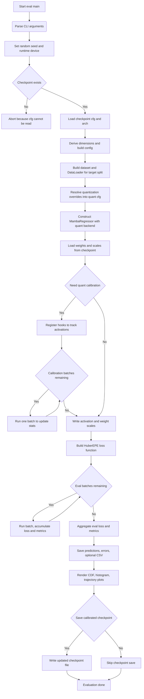

# Evaluation Workflow (Mamba Eval)

```mermaid
flowchart TD
    A[Start eval main] --> B(Parse CLI arguments)
    B --> C[Set random seed and runtime device]
    C --> D{Checkpoint exists}
    D -->|No| Z[Abort because cfg cannot be read]
    D -->|Yes| E[Load checkpoint cfg and arch]
    E --> F[Derive dimensions and build config]
    F --> G[Build dataset and DataLoader for target split]
    G --> H[Resolve quantization overrides into quant cfg]
    H --> I[Construct MambaRegressor with quant backend]
    I --> J[Load weights and scales from checkpoint]
    J --> K{Need quant calibration}
    K -->|Yes| L[Register hooks to track activations]
    L --> M{Calibration batches remaining}
    M -->|Yes| N[Run one batch to update stats]
    N --> M
    M -->|No| O[Write activation and weight scales]
    K -->|No| O
    O --> P[Build HuberEPE loss function]
    P --> Q{Eval batches remaining}
    Q -->|Yes| R[Run batch, accumulate loss and metrics]
    R --> Q
    Q -->|No| S[Aggregate eval loss and metrics]
    S --> T[Save predictions, errors, optional CSV]
    T --> U[Render CDF, histogram, trajectory plots]
    U --> V{Save calibrated checkpoint}
    V -->|Yes| W[Write updated checkpoint file]
    V -->|No| X[Skip checkpoint save]
    W --> Y[Evaluation done]
    X --> Y
```
