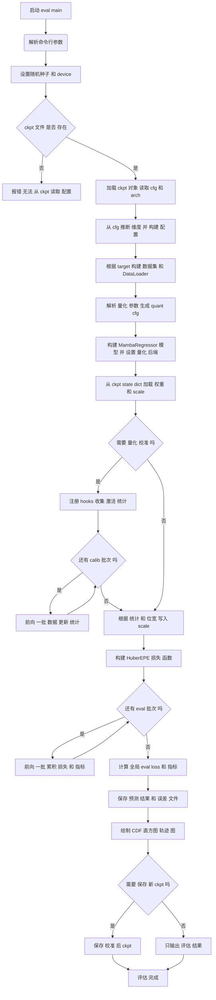

# 评估流程（Mamba Eval）

```mermaid
flowchart TD
    A[启动 eval main] --> B(解析命令行参数)
    B --> C[设置随机种子 和 device]
    C --> D{ckpt 文件 是否 存在}
    D -->|否| Z[报错 无法 从 ckpt 读取 配置]
    D -->|是| E[加载 ckpt 对象 读取 cfg 和 arch]
    E --> F[从 cfg 推断 维度 并 构建 配置]
    F --> G[根据 target 构建 数据集 和 DataLoader]
    G --> H[解析 量化 参数 生成 quant cfg]
    H --> I[构建 MambaRegressor 模型 并 设置 量化 后端]
    I --> J[从 ckpt state dict 加载 权重 和 scale]
    J --> K{需要 量化 校准 吗}
    K -->|是| L[注册 hooks 收集 激活 统计]
    L --> M{还有 calib 批次 吗}
    M -->|是| N[前向 一批 数据 更新 统计]
    N --> M
    M -->|否| O[根据 统计 和 位宽 写入 scale]
    K -->|否| O
    O --> P[构建 HuberEPE 损失 函数]
    P --> Q{还有 eval 批次 吗}
    Q -->|是| R[前向 一批 累积 损失 和 指标]
    R --> Q
    Q -->|否| S[计算 全局 eval loss 和 指标]
    S --> T[保存 预测 结果 和 误差 文件]
    T --> U[绘制 CDF 直方图 轨迹 图]
    U --> V{需要 保存 新 ckpt 吗}
    V -->|是| W[保存 校准 后 ckpt]
    V -->|否| X[只输出 评估 结果]
    W --> Y[评估 完成]
    X --> Y
```
