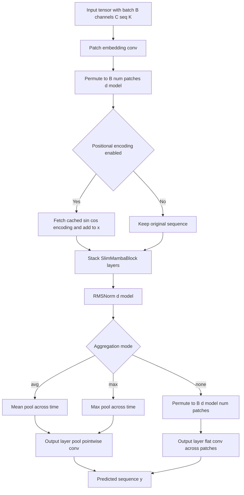

# MambaSlim Flowchart

```mermaid
flowchart TD
    A[Input tensor with batch B channels C seq K] --> B[Patch embedding conv]
    B --> C[Permute to B num patches d model]
    C --> D{Positional encoding enabled}
    D -->|Yes| E[Fetch cached sin cos encoding and add to x]
    D -->|No| F[Keep original sequence]
    E --> G
    F --> G
    G[Stack SlimMambaBlock layers] --> H[RMSNorm d model]
    H --> I{Aggregation mode}
    I -->|avg| J[Mean pool across time]
    I -->|max| K[Max pool across time]
    I -->|none| L[Permute to B d model num patches]
    J --> M[Output layer pool pointwise conv]
    K --> M
    L --> N[Output layer flat conv across patches]
    M --> O[Reshape to B channels forecast len]
    N --> O
    O[Predicted sequence y]
```
