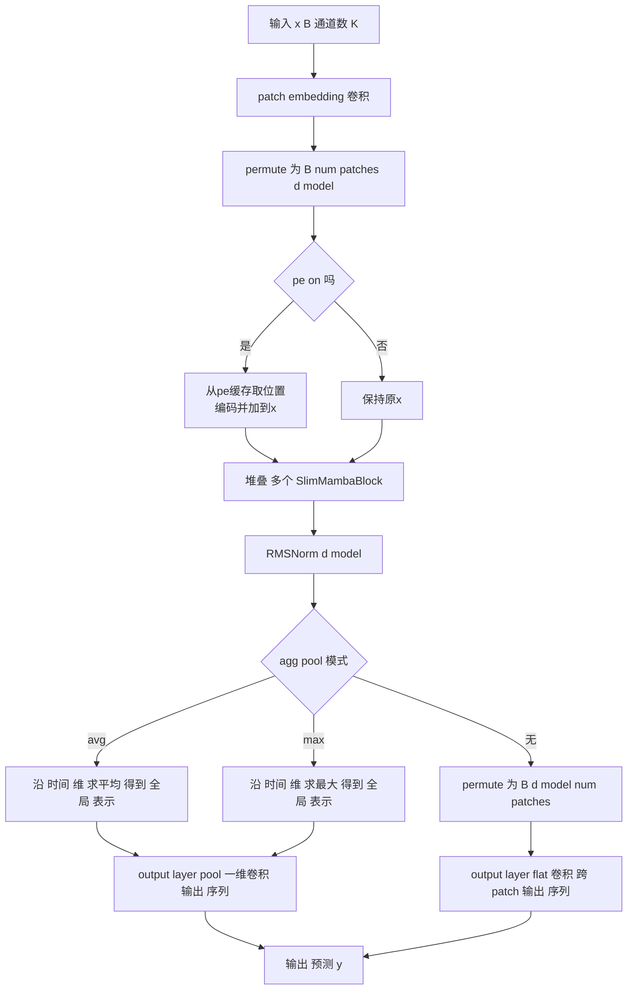

# MambaSlim flowchart

```mermaid
flowchart TD
    A[输入 x B 通道数 K] --> B[patch embedding 卷积]
    B --> C[permute 为 B num patches d model]
    C --> D{pe on 吗}
    D -->|是| E[从pe缓存取位置
    编码并加到x]
    D -->|否| F[保持原x]
    E --> G
    F --> G
    G[堆叠 多个 SlimMambaBlock] --> H[RMSNorm d model]
    H --> I{agg pool 模式}
    I -->|avg| J[沿 时间 维 求平均 得到 全局 表示]
    I -->|max| K[沿 时间 维 求最大 得到 全局 表示]
    I -->|无| L[permute 为 B d model num patches]
    J --> M[output layer pool 一维卷积 输出 序列]
    K --> M
    L --> N[output layer flat 卷积 跨 patch 输出 序列]
    M --> O[reshape 为 B 通道数 预测长度]
    N --> O
    O[输出 预测 y]
```
