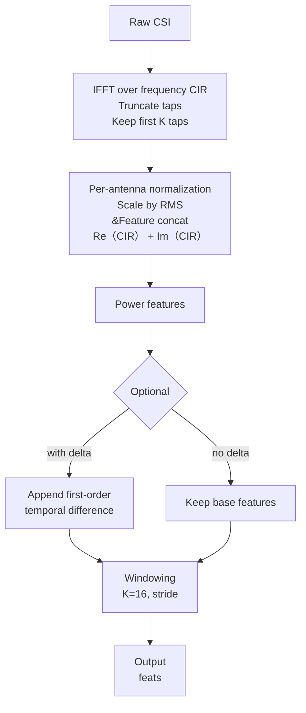

# Data Processing Pipeline （CSI ? CIR Features）

- Notes for PPT
  - Keep boxes short, use 2-line labels.
  - Left-to-right layout is slide-friendly.
  - Replace ?K taps? with your actual `taps` value if needed.
