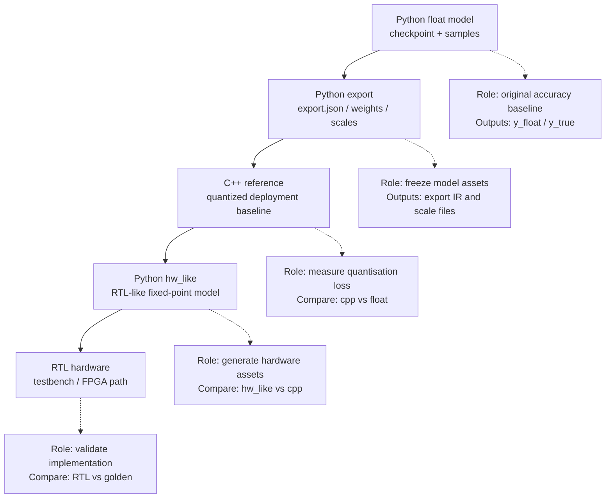

# Python / C++ / RTL 量化关系总图

本文只保留最终汇报需要的主线：Python 负责导出和硬件资产生成，C++ 负责部署量化 reference，RTL 负责消费 `.mem` 资产并实现硬件数据流。比较指标的作用是把误差拆成“模型/量化损失”和“硬件实现额外偏差”。

## 一张图



## 各部分到底是什么

| 名称 | 作用 | 典型输出 | 注意点 |
|---|---|---|---|
| `float model` | 原始 PyTorch 模型，是模型精度基准。 | `y_float.npy` | 代表未部署、未硬件化前的效果。 |
| `C++ reference` | 部署量化 reference，读取 `export.json` 和 `.npy` 资产跑 int16/int8/fake quant。 | `cpp_full_int16.npy` | 不是 RTL 逐信号 golden；它定义“当前部署量化方案最终应该输出什么”。 |
| `cpp_like` | Python 里复现 C++ reference 语义，用来拿中间 stage trace。 | `cpp_like stage trace` | 不调用 C++，目的是方便逐 stage 定位。 |
| `hw_like` | Python 里复现 RTL-like 定点语义，并生成 RTL 资产。 | `.mem`、golden、hw_like trace | 更接近 RTL 的 Q 格式、rounding、saturation、stage 边界。 |
| `RTL` | 真正硬件实现。 | RTL dump / captured output | 应该和 Python 生成的 golden / hw_like 对齐。 |

## 关键文件

| 文件 | 内容 |
|---|---|
| `final_hw/cases/<case>/float/y_true.npy` | 数据集真实标签。 |
| `final_hw/cases/<case>/float/y_float.npy` | PyTorch float model 输出。 |
| `final_hw/cases/<case>/float/cpp_full_int16.npy` | C++ reference 的最终输出，shape 通常是 `(N, 2)`。 |
| `final_hw/cases/<case>/logs/full_hw_like_eval.json` | 端到端比较：`hw_like`、`cpp`、`float`、`y_true`。 |
| `final_hw/cases/<case>/logs/dt_chain_debug_sample*.json` | 逐 stage 比较：`cpp_like_stage` vs `hw_like_stage`。 |
| `final_hw/cases/<case>/stages/.../*.mem` | RTL testbench 使用的输入、权重、scale、golden。 |

## 各个指标代表什么

| 指标 | 比较对象 | 衡量什么 | 如果很大说明什么 |
|---|---|---|---|
| `float vs y_true` | `y_float` 和 `y_true` | 原始模型任务精度。 | 模型本身效果不好，后面量化/RTL 很难补救。 |
| `cpp vs float` | `y_cpp` 和 `y_float` | 部署量化策略本身损失。 | 当前 int16/int8、scale、量化粒度或量化位置不够好。 |
| `cpp vs y_true` | `y_cpp` 和 `y_true` | 量化部署后的任务精度。 | 量化后实际任务效果下降。 |
| `hw_like vs cpp` | `y_hw_like` 和 `y_cpp` | 硬件定点语义相对 C++ reference 的额外偏差。 | RTL-like Q 格式、scale、rounding、saturation、stage 实现可能有问题。 |
| `hw_like vs float` | `y_hw_like` 和 `y_float` | 硬件语义最终离 float model 多远。 | 硬件化后的整体误差较大，但不能单独区分是量化损失还是硬件额外偏差。 |
| `hw_like vs y_true` | `y_hw_like` 和 `y_true` | 硬件语义下的最终任务精度。 | 最终硬件效果不满足要求。 |
| `stage mae / max_abs` | `cpp_like_stage` 和 `hw_like_stage` | 哪个内部 stage 开始偏离 reference。 | 该 stage 的硬件数值规则或 scale 是优先排查点。 |

## MAE / max_abs 怎么读

`mae` 是平均绝对误差：

```text
mae = mean(abs(a - b))
```

它反映整体平均偏差。

`max_abs` 是最大单元素绝对误差：

```text
max_abs = max(abs(a - b))
```

它反映最坏 outlier。

逐 stage debug 里，例如 `dt_chain_debug_sample0.json` 的 `mae` 是：

```text
mean(abs(cpp_like_stage - hw_like_stage))
```

它不是 `hw_like vs float`，也不是 `hw_like vs y_true`。

## Debug 判断逻辑

推荐按这个顺序判断：

1. 先看 `float vs y_true`：确认原始模型本身是否足够好。
2. 再看 `cpp vs float`：判断量化策略本身带来的损失。
3. 再看 `hw_like vs cpp`：判断硬件定点实现是否额外引入偏差。
4. 如果 `hw_like vs cpp` 大，再看 `dt_chain_debug_sample*.json` 的逐 stage `mae/max_abs`，定位第一个明显放大的 stage。
5. 最后用 RTL dump 和 `.mem` golden 比较，确认真实 RTL 是否复现 hw_like。

## Case 04 的 scale 问题示例

Case 04 中，`fixed_q88` 下逐 stage 对比发现 `selective_scan` MAE 明显偏高：

```text
selective_scan fixed_q88 avg MAE = 0.121098
```

前面的 `norm / inproj / dtproj / dt_sigmoid` 误差相对小，误差在 `selective_scan` 处首次显著放大。`selective_scan` 的核心硬件近似是 state 的定点表示和 scale，因此优先怀疑 fixed Q8.8 state scale 太粗。

调整为 `scaled_state` 后：

```text
selective_scan scaled_state avg MAE = 0.090323
下降 = 0.030776
改善 = 25.41%
```

这说明 state scale 不是实现细节，而是影响 `selective_scan` 精度的关键路径。改善也继续传到后面的 `ewm_gating`、`outproj` 和 `block_output`。

## 一句话总结

```text
C++ reference 用来定义当前部署量化方案的最终输出基准；
Python hw_like 用来复现 RTL-like 定点语义并生成硬件资产；
RTL 应该对齐 hw_like/golden；
各类误差指标用来区分模型误差、量化损失和硬件实现额外偏差。
```
