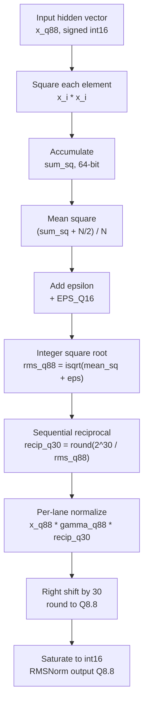
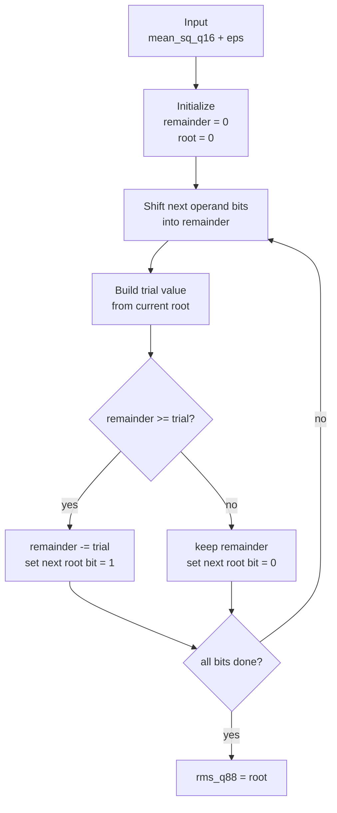
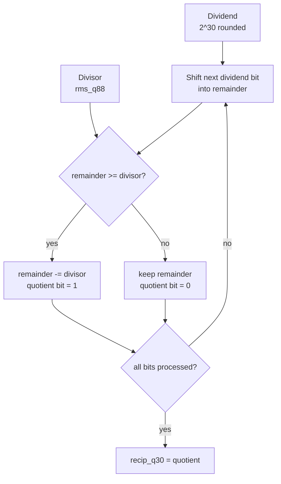

# RMSNorm Fixed-point Approximation

This note summarizes how the RMSNorm layer is approximated and mapped to RTL.
The main RTL module is:

```text
final_hw/rtl_reuse_shared/reuse_rmsnorm_scheduler.sv
```

## 1. Original RMSNorm Formula

For one hidden vector:

```text
x = [x0, x1, ..., xN-1]
```

RMSNorm computes:

```text
RMS(x) = sqrt(mean(x_i^2) + eps)
y_i    = x_i / RMS(x) * gamma_i
```

The hardware uses the equivalent multiply form:

```text
y_i = x_i * gamma_i * (1 / RMS(x))
```

This avoids doing one division per element. The reciprocal is computed once and
reused for all lanes.

## 2. Fixed-point Approximation

The RTL uses signed Q8.8 values for both input and gamma:

```text
x_q88     : signed int16
gamma_q88 : signed int16
```

The approximation flow is:

```text
sum_sq       = sum(x_q88 * x_q88)
mean_sq_q16  = round(sum_sq / N) + eps
rms_q88      = integer_sqrt(mean_sq_q16)
recip_q30    = round(2^30 / rms_q88)
y_q88        = round((x_q88 * gamma_q88 * recip_q30) >> 30)
```

Finally, `y_q88` is saturated to signed int16.

## 3. Approximation Flow



## 4. Integer Square Root Process

The RMS value is computed with a bit-serial integer square root. It avoids a
floating-point `sqrt` unit.

Conceptually, the module builds the root one bit at a time:

```text
candidate root -> square/compare through shift-subtract steps
if trial <= remainder:
    accept this root bit
else:
    reject this root bit
```

In the RTL this appears in the `ST_ISQRT` state. The key registers are:

```text
isqrt_rem
isqrt_op
isqrt_root
isqrt_iter
```

Simplified flow:



## 5. Sequential Divider / Trial-quotient Process

After `rms_q88` is known, the RTL computes:

```text
recip_q30 = round(2^30 / rms_q88)
```

This is not a one-cycle combinational divider. It is implemented as a
sequential divider in `ST_RECIP`.

The process is similar to long division:

```text
1. Shift the next dividend bit into the remainder.
2. Compare remainder with divisor.
3. If remainder >= divisor, subtract divisor and emit quotient bit 1.
4. Otherwise emit quotient bit 0.
5. Repeat for all quotient bits.
```

RTL registers:

```text
recip_num_reg   : dividend, approximately 2^30
recip_den_reg   : divisor, rms_q88
recip_rem_reg   : current remainder
recip_quot_reg  : generated quotient
recip_iter_reg  : bit counter
```

Trial-quotient flow:



## 6. Hardware Mapping Summary

| Step | Hardware behavior |
|---|---|
| Store input | `reuse_norm_raw_h_sram` stores raw hidden vector in Q8.8 |
| Store gamma | `reuse_norm_weight_mem` stores gamma in Q8.8 |
| Accumulate RMS | `reuse_rmsnorm_scheduler` reads 4 lanes per address and accumulates `sum_sq` |
| Compute RMS | `ST_ISQRT` computes integer square root |
| Compute reciprocal | `ST_RECIP` computes Q30 reciprocal by sequential division |
| Normalize | `x * gamma * recip_q30`, then shift right by 30 |
| Quantize output | `requant_round_sat_engine` rounds and clamps output to signed Q8.8 |

## 7. Short PPT Summary

- RMSNorm is implemented without floating-point arithmetic.
- The input and gamma are Q8.8 signed int16.
- RMS is estimated by integer square root of the mean square.
- The reciprocal `1/RMS` is computed once using a sequential divider.
- The same reciprocal is reused for all 4-lane tiles.
- Output is rounded and saturated back to Q8.8 for the following `in_proj`.

## 8. Float vs Hardware Approximation Curve

To show that the approximation is effective, compare the fixed-point hardware
output against a floating-point RMSNorm reference computed from the same
dequantized Q8.8 input and gamma. This isolates the RMSNorm hardware
approximation itself instead of mixing in earlier model-stage errors.

Recommended data:

| Data | File | Purpose |
|---|---|---|
| RMSNorm input `x_q88` | `final_hw/cases/c02/stages/reuse_mamba_block_top_block0/h_wr_data_s16_q8p8.mem` | Real stage input written into the RMSNorm raw-H SRAM |
| RMSNorm gamma `gamma_q88` | `final_hw/cases/c02/stages/reuse_mamba_block_top_block0/norm_gamma_s16_q8p8.mem` | Same Q8.8 gamma values used by RTL |
| Hardware output | `final_hw/cases/c02/stages/reuse_mamba_block_top_block0/h_norm_golden_s16_q8p8.mem` | Golden fixed-point RMSNorm output used by the RTL testbench |

The float reference is:

```text
x_float     = x_q88 / 256
gamma_float = gamma_q88 / 256
eps_float   = EPS_Q16 / 2^16

y_float = x_float / sqrt(mean(x_float^2) + eps_float) * gamma_float
```

The hardware curve is:

```text
y_hw = h_norm_golden_s16_q8p8 / 256
```

Generated comparison artifacts:

```text
final_hw/docs/rmsnorm_float_vs_hw.svg
final_hw/docs/rmsnorm_float_vs_hw.csv
```

Run the plot script with the mamba/conda Python environment:

```bash
'/mnt/d/Mamba/CMamba_refactor/Cmamba_reconstruct/.conda_torch/python.exe' \
  final_hw/docs/scripts/plot_rmsnorm_float_vs_hw.py
```

Current c02/block0 result:

```text
elements                = 128
max_abs_error_real      = 0.015625
mean_abs_error_real     = 0.004211
hw_model_mismatch_count = 0
```

Interpretation for PPT:

- The float and hardware curves should nearly overlap over the hidden-vector
  index.
- The error curve should stay small compared with the output dynamic range.
- `hw_model_mismatch_count = 0` means the software model of `isqrt + recip_q30`
  exactly matches the exported hardware golden data.
- Use c02/block0 as the main plot because it is real model data and already
  matches the RTL testbench files.
