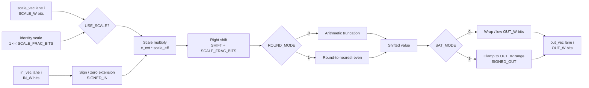
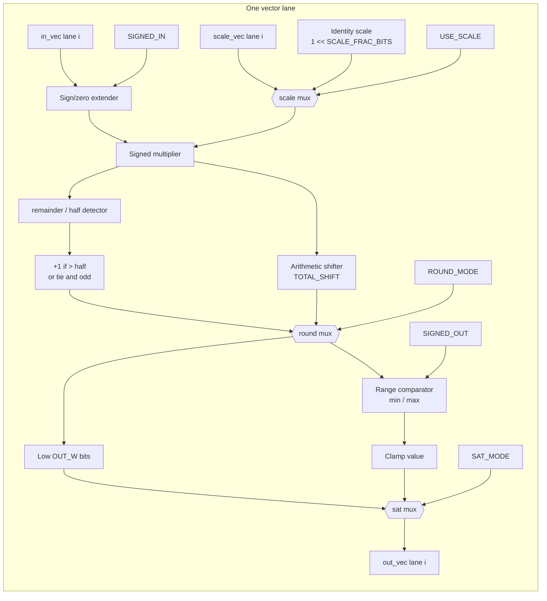

# RTL Quantization Modules: Architecture and Function

This note summarizes the RTL modules that implement quantized fixed-point behavior in `final_hw/rtl_reuse_shared`. The current hardware datapath is mainly organized around 4-lane vector processing (`TILE_SIZE=4`), Q-format conversion, rounding, saturation, and optional scale multiplication.

## 1. Overall Quantization Architecture

The quantization logic is not implemented as one single module. It is distributed across several reusable blocks:

```text
MAC / projection schedulers
    -> requant_round_sat_engine
    -> Q8.8 output SRAM / stream

sigmoid4_vec
    -> Q0.16 sigmoid / lambda

reuse_silu_vec4
    -> sigmoid(Q0.16) * x(Q8.8) -> Q8.8 SiLU output

ew_update_vec4
    -> selective scan state update
    -> fixed Q8.8 mode or scaled-state mode

ewm_gate_sbuf_vec4
    -> gate_y = ssm * z_silu

residual add / block output
    -> signed int16 clamp
```

The common low-level operation is:

```text
wide intermediate
    -> optional scale multiplication
    -> shift
    -> rounding
    -> saturation / cast to int16
```

This operation is centralized in `requant_round_sat_engine.sv`.

## 2. `requant_round_sat_engine` Hardware Architecture



The module is purely combinational per lane and is replicated across `TILE_SIZE` lanes. It implements the common RTL quantization operation:

```text
out = cast_or_saturate(round_or_trunc((input * scale) >> shift))
```

When `USE_SCALE=0`, the module internally uses the identity scale. When `USE_SCALE=1`, the caller supplies `scale_vec`, for example from a packed Q1.15 scale memory or a Q16 state-scale path.

### Implementation View

The following diagram shows the same module closer to the actual hardware structure for one lane.



Hardware interpretation:

| Block | Hardware role |
|---|---|
| sign/zero extender | expands `IN_W` input to multiplier width according to `SIGNED_IN` |
| scale mux | selects `scale_vec[i]` or identity scale |
| signed multiplier | computes `x_ext * scale_eff` |
| arithmetic shifter | performs the fixed right shift |
| remainder / half detector | detects whether round-to-nearest-even should increment |
| round mux | selects truncation or RNE output |
| range comparator | compares against signed or unsigned output range |
| saturation mux | selects wrapped low bits or clamped value |

For `TILE_SIZE=4`, this one-lane structure is instantiated four times in parallel inside the `for` loop of `requant_round_sat_engine.sv`.

## 3. Main Q Formats

| Q format / scale | Used in RTL | Meaning |
|---|---|---|
| `Q8.8`, scale `1/256` | block input/output, projection outputs, SiLU output, gate output | signed int16 activation format |
| `Q0.16`, scale `1/65536` | sigmoid LUT output, `lam_golden_q016` style lambda | unsigned sigmoid probability format |
| `Q1.15`, scale `1/32768` | selective scan internal lambda, optional post-scale coefficients | coefficient format for multiply/update |
| scaled int16 + Q16 scale | selective scan state path | state is stored as int16 with an extra scale factor |

## 4. `requant_round_sat_engine.sv`

This is the shared quantization core.

**Function**

```text
input vector
    -> optional multiply by per-lane scale
    -> right shift
    -> round
    -> cast or saturate to output width
```

**Key parameters**

| Parameter | Meaning |
|---|---|
| `TILE_SIZE` | number of vector lanes, usually 4 |
| `IN_W`, `OUT_W` | input and output bit width |
| `SHIFT` | fixed right shift amount |
| `SCALE_W`, `SCALE_FRAC_BITS` | scale coefficient format |
| `USE_SCALE` | enable `input * scale_vec` before shifting |
| `ROUND_MODE` | `0`: truncation, `1`: round-to-nearest-even |
| `SAT_MODE` | `0`: wrap, `1`: clamp to numeric range |

**Typical uses**

| Used by | Purpose |
|---|---|
| projection schedulers | MAC accumulator -> Q8.8 output |
| `ewm_vec4` | multiply result -> target Q format |
| `ewa_vec4` | add result -> int16 output |
| `ew_update_vec4` | scaled-state input/output conversion |
| `reuse_rmsnorm_scheduler` | RMSNorm output clamp to Q8.8 |

## 5. Projection Quantization

Projection layers include:

```text
in_proj
dt_proj
out_proj
```

They use the shared MAC fabric and then call `requant_round_sat_engine` to convert the accumulator back to signed int16 Q8.8.

Typical operation:

```text
Q8.8 activation * Q8.8 weight
    -> wide MAC accumulator
    -> shift right by 8
    -> round-to-nearest-even
    -> saturate to signed int16
```

The schedulers also support an optional Q1.15 post-scale path:

```text
acc_or_q88 * scale_q15
    -> shift by 15
    -> saturate
```

Relevant scale memories:

```text
inproj_scale_q15.mem
dt_scale_q15.mem
outproj_scale_q15.mem
```

In the current c02 setup these are identity coefficients, so the path is effectively a bypass:

```text
0x8000 encodes 1.0 in Q1.15
```

## 6. Sigmoid and SiLU Path

### `sigmoid4_vec.sv`

This module implements a 4-lane sigmoid approximation with a ROM lookup table.

**Input**

```text
Q8.8 signed int16
```

**Output**

```text
Q0.16 unsigned int16
```

The input is clamped to approximately:

```text
[-4.0, 4.0)
```

Then it is mapped to a 2048-entry LUT:

```text
sigmoid_lut_q016_2048.hex
```

The module includes an output quantization stage through `requant_round_sat_engine`, although the common configuration keeps the LUT output unchanged.

### `reuse_silu_vec4.sv`

This module computes:

```text
SiLU(x) = x * sigmoid(x)
```

The datapath is:

```text
x Q8.8
    -> sigmoid4_vec -> sigmoid Q0.16
    -> align x and sigmoid with axis_vec_join2
    -> ewm_vec4 multiply
    -> Q8.8 SiLU output
```

The multiply uses:

```text
Q0.16 * Q8.8 -> shift right by 16 -> Q8.8
```

## 7. Element-wise Multiply and Add

### `ewm_vec4.sv`

This is the generic 4-lane element-wise multiplier.

```text
a_vec * b_vec
    -> wide product
    -> requant_round_sat_engine
    -> y_vec
```

It is used for:

```text
SiLU: sigmoid * x
scan: lambda * state, (1-lambda) * u
gate: ssm * z_silu
```

### `ewa_vec4.sv`

This is the generic 4-lane element-wise adder.

```text
a_vec + b_vec
    -> one extra bit
    -> requant_round_sat_engine
    -> y_vec
```

It is used in the fixed-Q8.8 scan update path.

## 8. Selective Scan State Update

### `ew_update_vec4.sv`

This module implements:

```text
s_new = lambda * s_prev + (1 - lambda) * u
```

It supports two modes.

### Fixed Q8.8 Mode

In fixed mode:

```text
lambda: Q0.16 input converted to Q8.8
state:  Q8.8 signed int16
u:      Q8.8 signed int16
```

The update uses two `ewm_vec4` multipliers and one `ewa_vec4` adder:

```text
mul_a = lambda * s_prev
mul_b = (1 - lambda) * u
s_new = mul_a + mul_b
```

### Scaled-State Mode

In scaled-state mode:

```text
lambda: Q0.16 input converted to Q1.15
state:  scaled signed int16
u:      Q8.8 signed int16 converted to scaled int16
output: converted back to Q8.8
```

The main steps are:

```text
1. u_q88 -> scaled int16
   u_scaled = round((u_q88 * u_to_state_scale_q16) >> 16)

2. state update
   s_new = round((lam_q15 * s_prev + (32768 - lam_q15) * u_scaled) >> 15)

3. scaled state -> Q8.8 output
   ssm_q88 = round((s_new * state_to_q88_scale_q16) >> 16)
```

The conversion steps use `requant_round_sat_engine` with `USE_SCALE=1`.

### State SRAM

`ew_update_vec4` reads and writes a state buffer. It also contains bypass logic for the most recent write to avoid stale reads when BRAM latency would otherwise return old data.

## 9. State Scale Generation Path

### `reuse_state_scale_pingpong.sv`

This module buffers the scan input stream and produces per-lane scale vectors before forwarding data into `ew_update_vec4`.

It uses a 2-bank ping-pong buffer to decouple:

```text
incoming joined lambda/u stream
    from
ew_update consumption
```

### `reuse_runtime_scale_lane_seq.sv`

This module computes scale factors for one lane using sequential dividers:

```text
u_to_state_q16
state_to_q88_q16
```

Its purpose is to provide scale coefficients for the scaled-state path. In higher-level documentation, these scale values may also be generated from Python case data and represented as `.mem` assets; in this RTL path, the reusable modules accept scale vectors explicitly and can compute them in-stream through the ping-pong scale path.

## 10. Gate Path

### `ewm_gate_sbuf_vec4.sv`

This module computes:

```text
gate_y = ssm * z_silu
```

Both inputs are signed Q8.8 in the common hardware-like path.

The datapath is:

```text
ssm stream + z_silu stream
    -> axis_vec_join2 alignment
    -> ewm_vec4 signed multiply
    -> shift right by 8
    -> Q8.8 gate_y
```

It is instantiated inside the SSM core / top path after the EW update.

## 11. RMSNorm Quantization

### `reuse_rmsnorm_scheduler.sv`

RMSNorm reads:

```text
raw h Q8.8
gamma Q8.8
```

It accumulates squared values, computes an RMS / reciprocal approximation, multiplies by gamma, and emits Q8.8 output through `requant_round_sat_engine`.

The final output is:

```text
RMSNorm output Q8.8 signed int16
```

with rounding and saturation enabled by parameters such as:

```text
NORM_OUT_ROUND_MODE
NORM_OUT_SAT_MODE
```

## 12. Saturation and Clamp

The main signed int16 clamp range is:

```text
[-32768, 32767]
```

For Q8.8 this corresponds to approximately:

```text
[-128.0, 127.996]
```

Clamp is used to prevent overflow from wrapping into an incorrect sign. It is handled centrally by `requant_round_sat_engine` when `SAT_MODE=1`.

Residual addition also uses explicit signed int16 saturation in `reuse_block_pipeline_ctrl.sv`.

## 13. Summary

The RTL quantization architecture is built around a small set of reusable vector modules:

| Module | Role |
|---|---|
| `requant_round_sat_engine` | shared shift, round, scale, saturation engine |
| `sigmoid4_vec` | Q8.8 input to Q0.16 sigmoid LUT output |
| `reuse_silu_vec4` | SiLU using sigmoid LUT and element-wise multiply |
| `ewm_vec4` | generic 4-lane element-wise multiply |
| `ewa_vec4` | generic 4-lane element-wise add |
| `ew_update_vec4` | selective scan state update |
| `ewm_gate_sbuf_vec4` | output gate multiply |
| `reuse_packed_scale_mem` | packed 4-lane Q1.15 scale memory |
| `reuse_state_scale_pingpong` | scale-vector buffering/generation for scaled scan |
| `reuse_rmsnorm_scheduler` | RMSNorm fixed-point output path |

The key design idea is to keep most tensors in Q8.8 signed int16, use Q0.16 for sigmoid outputs, convert lambda to Q1.15 for scan updates, and centralize rounding/saturation through a shared requantization engine.
