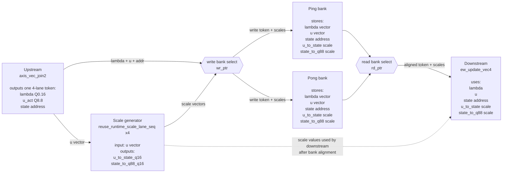

# Selective Scan Buffer, Quantization, and Compute Architecture

This note summarizes the hardware structure around the selective scan path, especially why the scale path uses buffering and how the quantized state update is computed.

## What Selective Scan Computes

Selective scan is the recurrent state update inside the Mamba block. For each time step and channel, it computes:

```text
s_t = lambda_t * s_{t-1} + (1 - lambda_t) * u_t
```

where:

```text
lambda_t : decay/update coefficient generated from dt sigmoid
u_t      : current activated input, usually u_act
s_t      : updated state, later converted to the SSM output
```

This stage gives the block sequence memory. Its output is later multiplied with the gate branch:

```text
gate_y = ssm * z_silu
```

## Why the Buffer Exists

In the scaled-state selective scan path, the input stream provides:

```text
lambda + u_act
```

but the state update also needs scale factors:

```text
u_to_state_q16
state_to_q88_q16
```

These scale values may take extra cycles to prepare because they require per-lane scale calculation or memory access. The buffer is used to:

- decouple the incoming `lambda/u` stream from the slower scale-generation path;
- keep `lambda`, `u`, address, and scale aligned for the same token;
- absorb backpressure between scale generation and `ew_update_vec4`;
- allow ping-pong operation so one bank can be filled while the other is consumed.

In RTL this role is mainly handled by:

```text
reuse_state_scale_pingpong.sv
```

## Hardware Architecture



This diagram focuses on the buffer interface. The upstream join produces one 4-lane token at a time. The ping-pong buffer writes the token and its generated scale vectors into one bank, while the other bank can be read by `ew_update_vec4`. The downstream block is shown as one box because the key point here is token/scale alignment before the scan update.

## Dataflow Explanation

### 1. Input alignment

The incoming stream contains:

```text
lambda_q016
u_q88
state address
```

The ping-pong buffer stores this token while scale factors are generated. This prevents the input stream from being tied directly to the latency of scale computation.

### 2. Scale generation

`reuse_runtime_scale_lane_seq` computes per-lane scale coefficients:

```text
u_to_state_q16
state_to_q88_q16
```

These are Q16-style scale factors used by `requant_round_sat_engine` with `USE_SCALE=1`.

### 3. Lambda conversion

The sigmoid output lambda is originally Q0.16:

```text
lambda_real = lambda_q016 / 65536
```

Inside the scaled-state update, it is converted to Q1.15:

```text
lam_q15 = lam_q016 >> 1
```

This makes the update equation hardware-friendly:

```text
1.0 = 32768
1 - lambda = 32768 - lam_q15
```

### 4. Input-to-state quantization

The Q8.8 input is converted to scaled int16:

```text
u_scaled = round((u_q88 * u_to_state_q16) >> 16)
```

This allows the state SRAM to store a scaled int16 state rather than raw Q8.8.

### 5. State update

The core recurrence is:

```text
s_new = lambda * s_prev + (1 - lambda) * u
```

In hardware scaled-state form:

```text
s_new = round((lam_q15 * s_prev
             + (32768 - lam_q15) * u_scaled) >> 15)
```

The result is saturated to signed int16 and written back to the state SRAM.

### 6. State-to-Q8.8 output conversion

The internal state is scaled int16, but the downstream gate expects Q8.8. Therefore the state output is converted back:

```text
ssm_q88 = round((s_new * state_to_q88_q16) >> 16)
```

The output `ssm_q88` is then consumed by the gate path:

```text
gate_y = ssm_q88 * z_silu_q88
```

## Module Roles

| Module | Role |
|---|---|
| `reuse_state_scale_pingpong.sv` | buffers lambda/u/address tokens and aligns them with scale vectors |
| `reuse_runtime_scale_lane_seq.sv` | computes per-lane `u_to_state_q16` and `state_to_q88_q16` |
| `ew_update_vec4.sv` | performs lambda conversion, input scaling, state update, state writeback, and Q8.8 output conversion |
| `requant_round_sat_engine.sv` | shared scale multiply, rounding, shift, and saturation block |
| state SRAM inside `ew_update_vec4` | stores the recurrent scaled int16 state |

## Key Point

The buffer is not only for storage. It is a timing and alignment structure: it lets the hardware prepare scale factors without losing token order, while ensuring that each `lambda/u` pair is updated with the correct state address and scale values.
