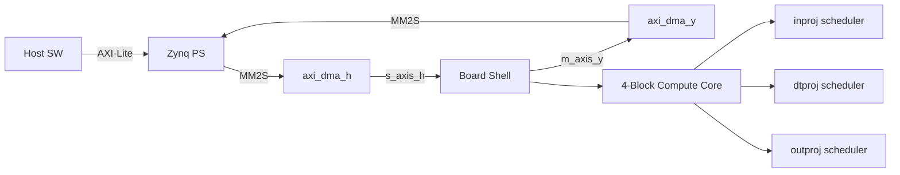
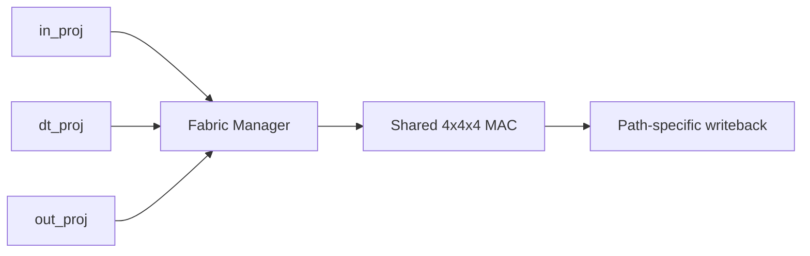
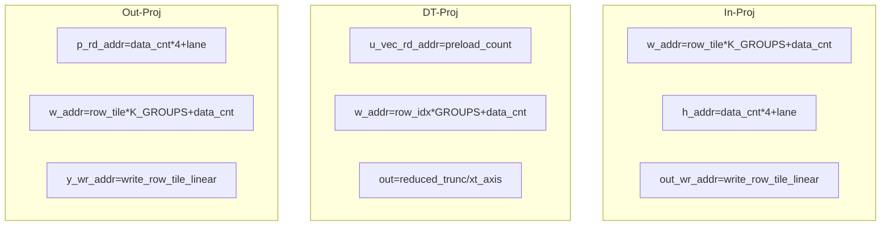

# Thesis Draw.io Design Notes

## 1. Source and Scope
- Primary RTL source used for mapping: `HW_reconstruct/rtl_reuse_shared`.
- Key modules reviewed:
  - `reuse_mamba_board_shell.v`
  - `reuse_mamba_h_stream_loader.v`
  - `reuse_mamba_4block_chain_top.sv`
  - `reuse_block_pipeline_ctrl.sv`
  - `reuse_in_proj_scheduler.sv`
  - `reuse_ssm_dt_scheduler.sv`
  - `reuse_out_proj_scheduler.sv`
  - `reuse_mac_fabric_manager.sv`

## 2. Design Intent by Page
- `P1 Overall Archi + Board Data`
  - Reuse `reuse_archi_linear` style and hierarchy.
  - Explicitly show `4-Block Compute Core` inside `Board Shell`.
- `P2 Shell + Inter-Block Pipeline`
  - Merge shell input and inter-block control path.
  - Show stream ingress -> loader -> shadow buffer -> chain adapter -> block chain -> pipeline control -> output stream.
- `P3 Block MAC Reuse`
  - Show in/dt/out three logical paths sharing one physical MAC fabric through manager arbitration.
- `P4 Memory Mapping RTL`
  - Use explicit address mapping formulas from schedulers.

## 3. RTL Mapping Summary
### In-Proj (`reuse_in_proj_scheduler.sv`)
- `h_rd_addr0..3 = data_cnt*4 + lane`
- `w_addr_sel[*] = row_tile_linear*K_GROUPS + data_cnt`
- `out_wr_addr = write_row_tile_linear` (split to u/z by range)

### DT-Proj (`reuse_ssm_dt_scheduler.sv`)
- Preload: `u_vec_rd_addr = preload_count`, cache into `x_cache`
- Weight read: `w_addr_cur = row_idx*GROUPS + data_cnt`
- B-row index: `data_cnt*4 + lane`
- Output: `reduced_trunc`, `xt_axis_TDATA`

### Out-Proj (`reuse_out_proj_scheduler.sv`)
- `p_rd_addr0..3 = data_cnt*4 + lane`
- `w_addr_sel[*] = row_tile_linear*K_GROUPS + data_cnt`
- `y_wr_addr = write_row_tile_linear`, `y_axis_TDATA = y_wr_data`

### Shared Arbitration (`reuse_mac_fabric_manager.sv`)
- Priority: `dt_busy > in_busy > out_busy`
- Single active owner drives shared fabric each cycle.

## 4. Mermaid Drafts
### P1

### P3

### P4

## 5. Visual Design Spec (academic_diagram_style_guide aligned)
- Font: `Times New Roman`.
- Main text color: `#17365D`.
- Border/arrow color: `#2F5597`.
- Fill palette: `#EAF2FF`, `#F7FBFF`, `#DBEAFE`.
- Node type: rounded rectangle.
- Border width: `1.5`.
- Connector labels: no background fill (`labelBackgroundColor=none`).
- Page size: `1600 x 900` (16:9, PPT aligned).
