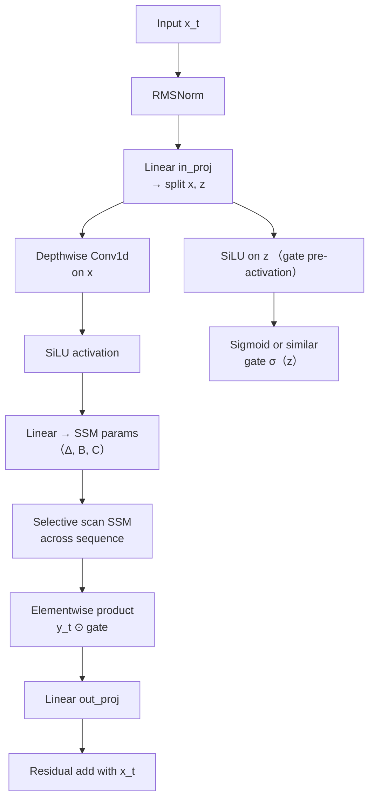
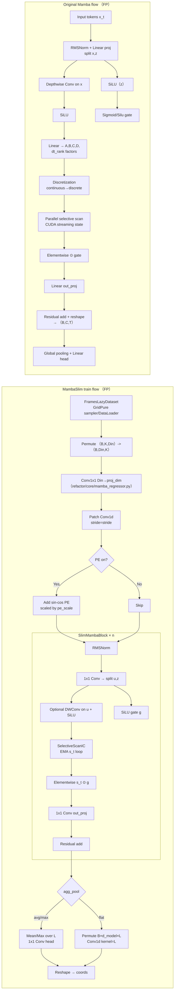

# Mamba （Original）

```mermaid
flowchart TD
    A[Input x_t] --> B[RMSNorm]

    B --> C[Linear in_proj<br/>→ split x, z]
    
    %% 主干路径：卷积 + 非线性 + SSM 参数
    C --> D[Depthwise Conv1d<br/>on x]
    D --> E[SiLU activation]
    E --> F[Linear → SSM params<br/>（Δ, B, C）]
    F --> G[Selective scan SSM<br/>across sequence]

    %% 门控路径
    C --> H[SiLU on z （gate pre-activation）]
    H --> I[Sigmoid or similar<br/>gate σ（z）]

    %% 融合 + 输出
    G --> J[Elementwise product<br/>y_t ⊙ gate]
    J --> K[Linear out_proj]
    K --> L[Residual add with x_t]

```

```mermaid
flowchart LR
    subgraph Slim["MambaSlim train flow （FP）"]
        s0[FramesLazyDataset<br/>GridPure sampler/DataLoader] --> s1[Permute （B,K,Din）->（B,Din,K）]
        s1 --> s2[Conv1x1 Din→proj_dim<br/>（refactor/core/mamba_regressor.py）]
        s2 --> s3[Patch Conv1d<br/>stride=stride]
        s3 --> s4{PE on?}
        s4 -->|Yes| s5[Add sin-cos PE<br/>scaled by pe_scale]
        s4 -->|No| s6[Skip]
        s5 --> s7
        s6 --> s7
        subgraph SlimBlk["SlimMambaBlock × n"]
            s7[RMSNorm] --> s8[1x1 Conv → split u,z]
            s8 --> s9[Optional DWConv on u + SiLU]
            s9 --> s10[SelectiveScanIC<br/>EMA s_t loop]
            s8 --> s11[SiLU gate g]
            s10 --> s12[Elementwise s_t ⊙ g]
            s12 --> s13[1x1 Conv out_proj]
            s13 --> s14[Residual add]
        end
        s14 --> s15{agg_pool}
        s15 -->|avg/max| s16[Mean/Max over L<br/>1x1 Conv head]
        s15 -->|flat| s17[Permute B×d_model×L<br/>Conv1d kernel=L]
        s16 --> s18[Reshape → coords]
        s17 --> s18
    end
    subgraph Orig["Original Mamba flow （FP）"]
        o0[Input tokens x_t] --> o1[RMSNorm + Linear proj<br/>split x,z]
        o1 --> o2[Depthwise Conv on x]
        o2 --> o3[SiLU]
        o3 --> o4[Linear → A,B,C,D,<br/>dt_rank factors]
        o4 --> o5[Discretization<br/>continuous→discrete]
        o5 --> o6[Parallel selective scan<br/>CUDA streaming state]
        o1 --> o7[SiLU（z）]
        o7 --> o8[Sigmoid/Silu gate]
        o6 --> o9[Elementwise ⊙ gate]
        o9 --> o10[Linear out_proj]
        o10 --> o11[Residual add + reshape<br/>→ （B,C,T）]
        o11 --> o12[Global pooling + Linear head]
    end
```
