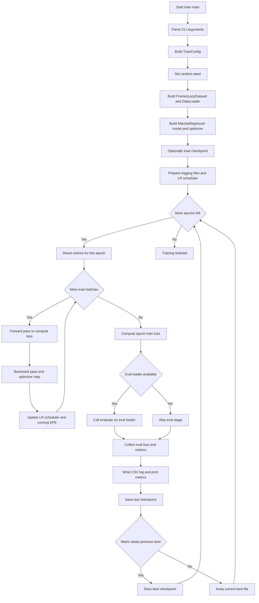

# Training & Evaluation Workflow (Mamba)

```mermaid
flowchart TD
    A[Start train main] --> B(Parse CLI arguments)
    B --> C[Build TrainConfig]
    C --> D[Set random seed]
    D --> E[Build FramesLazyDataset and DataLoader]
    E --> F[Build MambaRegressor model and optimizer]
    F --> G[Optionally load checkpoint]
    G --> H[Prepare logging files and LR scheduler]
    H --> I{More epochs left}
    I -->|Yes| J[Reset metrics for this epoch]
    J --> K{More train batches}
    K -->|Yes| L[Forward pass to compute loss]
    L --> M[Backward pass and optimizer step]
    M --> N[Update LR scheduler and running EPE]
    N --> K
    K -->|No| O[Compute epoch train loss]
    O --> P{Eval loader available}
    P -->|Yes| Q[Call evaluate on eval loader]
    P -->|No| R[Skip eval stage]
    Q --> S[Collect eval loss and metrics]
    R --> S
    S --> T[Write CSV log and print metrics]
    T --> U[Save last checkpoint]
    U --> V{Metric beats previous best}
    V -->|Yes| W[Save best checkpoint]
    V -->|No| X[Keep current best file]
    W --> I
    X --> I
    I -->|No| Y[Training finished]
```
