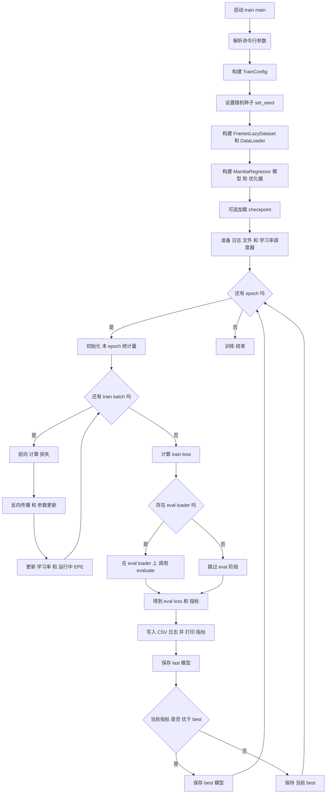

# 训练与评估流程（Mamba）

```mermaid
flowchart TD
    A[启动 train main] --> B(解析命令行参数)
    B --> C[构建 TrainConfig]
    C --> D[设置随机种子 set_seed]
    D --> E[构建 FramesLazyDataset 和 DataLoader]
    E --> F[构建 MambaRegressor 模型 和 优化器]
    F --> G[可选加载 checkpoint]
    G --> H[准备 日志 文件 和 学习率调度器]
    H --> I{还有 epoch 吗}
    I -->|是| J[初始化 本 epoch 统计量]
    J --> K{还有 train batch 吗}
    K -->|是| L[前向 计算 损失]
    L --> M[反向传播 和 参数更新]
    M --> N[更新 学习率 和 运行中 EPE]
    N --> K
    K -->|否| O[计算 train loss]
    O --> P{存在 eval loader 吗}
    P -->|是| Q[在 eval loader 上 调用 evaluate]
    P -->|否| R[跳过 eval 阶段]
    Q --> S[得到 eval loss 和 指标]
    R --> S
    S --> T[写入 CSV 日志 并 打印 指标]
    T --> U[保存 last 模型]
    U --> V{当前指标 是否 优于 best}
    V -->|是| W[保存 best 模型]
    V -->|否| X[保持 当前 best]
    W --> I
    X --> I
    I -->|否| Y[训练 结束]
```
