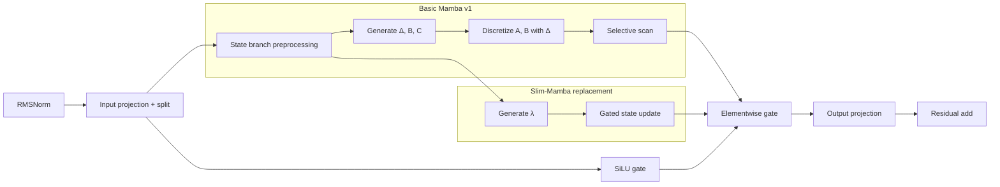

```mermaid
flowchart LR
    a1["RMSNorm"] --> a2["Input projection + split"]
    a2 --> a3["State branch preprocessing"]
    a2 --> a4["SiLU gate"]

    subgraph M1["Basic Mamba v1"]
        a3 --> m1["Generate Δ, B, C"]
        m1 --> m2["Discretize A, B with Δ"]
        m2 --> m3["Selective scan"]
    end

    subgraph M2["Slim-Mamba replacement"]
        a3 --> s1["Generate λ"]
        s1 --> s2["Gated state update"]
    end

    m3 --> o1["Elementwise gate"]
    s2 --> o1
    a4 --> o1
    o1 --> o2["Output projection"]
    o2 --> o3["Residual add"]
```

```mermaid
flowchart TB
    subgraph Top["Basic Mamba v1"]
        t1["RMSNorm"] --> t2["Input projection + split"]
        t2 --> t3["State branch (DWConv + SiLU)"]
        t2 --> t4["Gate branch (SiLU)"]
        t3 --> t5["Generate Δ, B, C"]
        t5 --> t6["Discretize A, B with Δ"]
        t6 --> t7["Selective scan"]
        t7 --> t8["Elementwise gate"]
        t4 --> t8
        t8 --> t9["Output projection"]
        t9 --> t10["Residual add"]
    end

    subgraph Bottom["Slim-Mamba"]
        b1["RMSNorm"] --> b2["Input projection + split"]
        b2 --> b3["State branch (DWConv + SiLU)"]
        b2 --> b4["Gate branch (SiLU)"]
        b3 --> b5["Generate λ"]
        b5 --> b6["Gated state update"]
        b6 --> b7["Elementwise gate"]
        b4 --> b7
        b7 --> b8["Output projection"]
        b8 --> b9["Residual add"]
    end
```